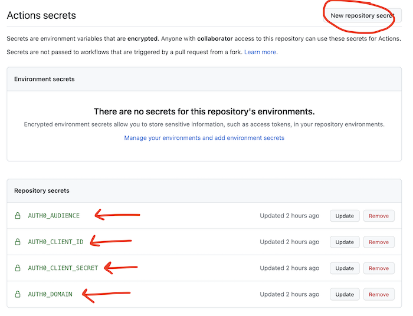

# Add Auth0 credentials to your Git repository

The automated tests in GitHub need to know your Auth0 credentials.

**Note** This is only required for this project, you would not normally need to do this.

1. In Auth0, navigate to the Applications page, and open the machine to machine application. You will need the values of the following settings in the next steps.

   

2. Open your repository on GitHub, and click "Settings"

   

3. Choose `Secrets` from the left hand navigation

   

4. Click `New repository secret`. Create secrets with the following names and values:
   - `AUTH0_DOMAIN`: The domain from the application settings page in Auth0
   - `AUTH0_CLIENT_ID`: The client id from the application settings in Auth0
   - `AUTH0_CLIENT_SECRET`: The client secret from the application settings in Auth0
   - `AUTH0_AUDIENCE`: The value set for `audience` in your API in Auth0

      
